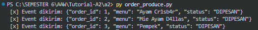
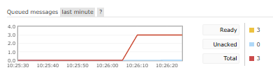
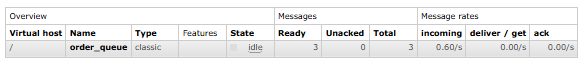
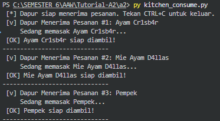
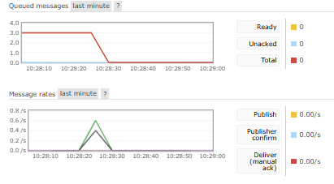
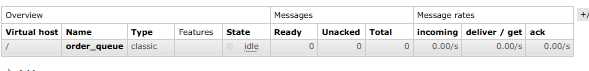

# Assignment A2 - Arsitektur Aplikasi Web
## Priscilla Natanael Surjanto/2306152153

#### **Demonstrasi**

1. Menjalankan `py order_produce.py` untuk mengirim event order yang dibuat

2. Cek Overview RabbitMQ untuk queued messages yang masuk melalui message broker

3. Menjalankan `py kitchen_consume.py` untuk simulasi dapur menerima order yang masuk (queued messages yang belum diterima)

Message dari queue sudah diterima consumer, dan queue jadi kosong.

#### **Penjelasan**
Mekanisme komunikasi asynchronous ini bekerja dengan memanfaatkan message broker sebagai perantara, memungkinkan komunikasi terjadi secara tidak langsung. Dalam demonstrasi dapat dilihat bahwa producer/publisher hanya perlu mengirimkan event ke message broker tanpa perlu consumer aktif/tidak. Event yang dikirim ditampung dalam queue message broker sampai ada consumer yang memprosesnya.

Sementara, komunikasi request-response biasa merupakan komunikasi synchronous yang mengharuskan komunikasi terjadi secara langsung. Jika pengirim mengirim message, maka penerima harus aktif dan menerima saat itu juga. Ini juga mengakibatkan pengirim harus menunggu sampai proses selesai. 

Kelebihan dari mekanisme asynchronous adalah skalabilitas terjaga karena messages yang masuk saat trafik tinggi bisa ditampung terlebih dahulu di queue, sementara synchronous memiliki skalabilitas buruk di trafik tinggi karena mengharuskan semua langsung dihandle saat itu juga.

#### **AI Declaration**
Pada tugas ini, saya memanfaatkan Gemini AI untuk membantu saya memahami requirements dari tugas, memahami alur pengiriman pesan pada komunikasi asynchronous, dan memverifikasi apakah pengerjaan saya sudah sesuai requirements tersebut. 